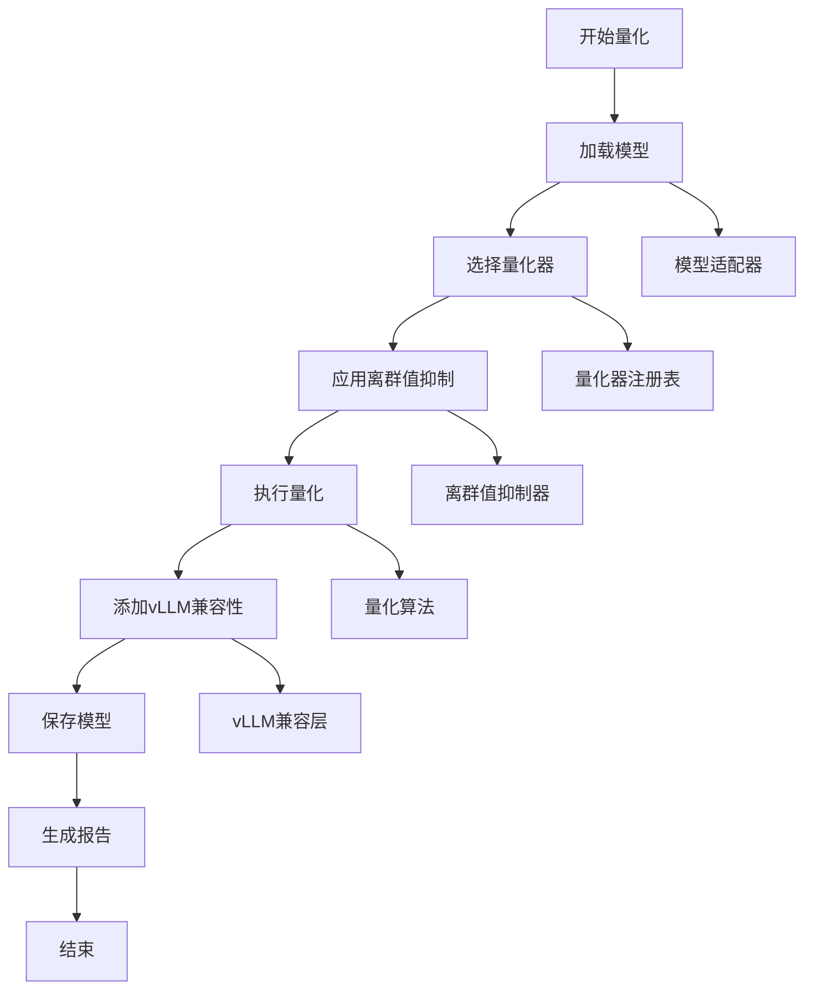

# 大模型量化工具 - 4+1架构视图文档

## 概述

本文档使用4+1架构视图来描述大模型量化工具的设计，帮助你快速理解项目结构和上手使用。

## 1. 逻辑视图 (Logical View)

### 1.1 核心概念

```
┌─────────────────────────────────────────────────────────────┐
│                    大模型量化工具                            │
├─────────────────────────────────────────────────────────────┤
│  量化管理器 (QuantizationManager)                           │
│  ├── 模型加载与适配                                         │
│  ├── 量化算法执行                                           │
│  ├── 离群值抑制                                             │
│  └── 结果保存                                               │
├─────────────────────────────────────────────────────────────┤
│  注册表系统 (Registry System)                               │
│  ├── 模型注册表 (ModelRegistry)                             │
│  ├── 量化器注册表 (QuantizerRegistry)                       │
│  └── 离群值抑制注册表 (OutlierSuppressionRegistry)          │
├─────────────────────────────────────────────────────────────┤
│  适配器层 (Adapter Layer)                                   │
│  ├── 基础适配器 (BaseHuggingFaceAdapter)                    │
│  ├── Llama适配器 (LlamaAdapter)                             │
│  └── Qwen适配器 (QwenAdapter)                               │
├─────────────────────────────────────────────────────────────┤
│  量化算法层 (Quantization Layer)                            │
│  ├── GPTQ量化器 (GPTQQuantizer)                             │
│  ├── AWQ量化器 (AWQQuantizer)                               │
│  └── MinMax量化器 (MinMaxQuantizer)                         │
├─────────────────────────────────────────────────────────────┤
│  离群值抑制层 (Outlier Suppression Layer)                   │
│  └── SmoothQuant抑制器 (SmoothQuantSuppressor)              │
└─────────────────────────────────────────────────────────────┘
```

### 1.2 主要组件职责

| 组件 | 职责 | 关键方法 |
|------|------|----------|
| **量化管理器** | 协调整个量化流程 | `quantize()`, `_init_components()` |
| **模型注册表** | 管理不同模型的适配器 | `register()`, `get_adapter()` |
| **量化器注册表** | 管理不同的量化算法 | `register()`, `get_quantizer()` |
| **基础适配器** | 提供通用模型操作 | `load_model()`, `save_model()` |
| **量化器** | 实现具体的量化算法 | `quantize()`, `_add_vllm_compatibility()` |

## 2. 进程视图 (Process View)

### 2.1 量化流程



### 2.2 命令行执行流程

```
用户输入命令
    ↓
解析参数 (click)
    ↓
创建量化管理器
    ↓
初始化组件 (注册表)
    ↓
加载模型 (适配器)
    ↓
执行量化 (量化器)
    ↓
保存结果 (适配器)
    ↓
生成报告
```

### 2.3 组件交互时序

```
用户    CLI    管理器    注册表    适配器    量化器    vLLM
 │       │       │        │        │        │        │
 │──量化请求──→│       │        │        │        │        │
 │       │──创建管理器──→│        │        │        │        │
 │       │       │──获取适配器──→│        │        │        │
 │       │       │        │──加载模型──→│        │        │
 │       │       │──获取量化器──→│        │        │        │
 │       │       │        │        │──执行量化──→│        │
 │       │       │        │        │        │──vLLM兼容──→│
 │       │       │        │        │──保存模型──→│        │
 │       │       │        │        │        │        │
 │←──完成──│       │        │        │        │        │
```

## 3. 开发视图 (Development View)

### 3.1 项目结构

```
quant/
├── quantize.py                 # 主入口脚本
├── deploy_vllm.py             # vLLM部署工具
├── requirements.txt           # 依赖管理
├── README.md                  # 项目说明
├── src/                       # 源代码目录
│   ├── __init__.py
│   ├── registry_init.py       # 注册表初始化
│   ├── core/                  # 核心框架
│   │   ├── __init__.py
│   │   ├── quantization_manager.py
│   │   ├── model_registry.py
│   │   ├── quantizer_registry.py
│   │   └── outlier_suppression_registry.py
│   ├── models/                # 模型适配器
│   │   ├── __init__.py
│   │   ├── base_adapter.py
│   │   ├── llama_adapter.py
│   │   └── qwen_adapter.py
│   ├── quantizers/            # 量化算法
│   │   ├── __init__.py
│   │   ├── gptq_quantizer.py
│   │   ├── awq_quantizer.py
│   │   └── minmax_quantizer.py
│   ├── outlier_suppression/   # 离群值抑制
│   │   ├── __init__.py
│   │   └── smooth_quant.py
│   └── utils/                 # 工具模块
│       ├── __init__.py
│       ├── config.py
│       └── logging.py
├── configs/                   # 配置文件
│   ├── gptq_config.yaml
│   ├── awq_config.yaml
│   ├── minmax_config.yaml
│   └── smooth_quant_config.yaml
├── docs/                      # 文档
│   ├── extension_guide.md
│   └── 4plus1_architecture.md
└── tests/                     # 测试
    ├── test_framework.py
    └── simple_test.py
```

### 3.2 模块依赖关系

```
┌─────────────┐    ┌─────────────┐    ┌─────────────┐
│  quantize.py │    │ deploy_vllm.py │    │  test_framework.py │
└─────┬───────┘    └─────────────┘    └─────┬───────┘
      │                                    │
      └─────────────┬──────────────────────┘
                    │
        ┌───────────▼───────────┐
        │   src/                │
        │   ├── registry_init.py│
        │   ├── core/           │
        │   ├── models/         │
        │   ├── quantizers/     │
        │   ├── outlier_suppression/ │
        │   └── utils/          │
        └───────────────────────┘
```

### 3.3 扩展点设计

| 扩展类型 | 扩展点 | 实现方式 | 示例 |
|----------|--------|----------|------|
| **新量化算法** | `BaseQuantizer` | 继承基类，实现`quantize()` | `MinMaxQuantizer` |
| **新模型支持** | `BaseModelAdapter` | 继承基类，实现必要方法 | `LlamaAdapter` |
| **新离群值抑制** | `BaseOutlierSuppressor` | 继承基类，实现`apply()` | `SmoothQuantSuppressor` |
| **新配置格式** | `load_config()` | 扩展配置文件加载 | YAML/JSON支持 |

## 4. 物理视图 (Physical View)

### 4.1 部署架构

```
┌─────────────────────────────────────────────────────────────┐
│                        用户环境                              │
├─────────────────────────────────────────────────────────────┤
│  量化工具 (Python环境)                                       │
│  ├── quantize.py (CLI工具)                                  │
│  ├── deploy_vllm.py (部署工具)                              │
│  └── src/ (核心库)                                          │
├─────────────────────────────────────────────────────────────┤
│  vLLM服务 (生产环境)                                         │
│  ├── API服务器                                              │
│  ├── 量化模型                                               │
│  └── 配置文件                                               │
├─────────────────────────────────────────────────────────────┤
│  存储系统                                                   │
│  ├── 原始模型                                               │
│  ├── 量化模型                                               │
│  └── 校准数据                                               │
└─────────────────────────────────────────────────────────────┘
```

### 4.2 运行时组件

```
┌─────────────────┐    ┌─────────────────┐    ┌─────────────────┐
│   用户命令行     │    │   量化管理器     │    │   vLLM服务      │
│                 │    │                 │    │                 │
│ • 参数解析      │◄──►│ • 组件协调      │◄──►│ • API服务       │
│ • 日志输出      │    │ • 流程控制      │    │ • 模型加载       │
│ • 错误处理      │    │ • 状态管理      │    │ • 推理执行       │
└─────────────────┘    └─────────────────┘    └─────────────────┘
         │                       │                       │
         ▼                       ▼                       ▼
┌─────────────────┐    ┌─────────────────┐    ┌─────────────────┐
│   配置文件       │    │   注册表系统     │    │   量化模型      │
│                 │    │                 │    │                 │
│ • YAML配置      │    │ • 组件注册      │    │ • 权重文件       │
│ • 参数验证      │    │ • 动态发现      │    │ • 配置文件       │
│ • 默认值管理    │    │ • 类型检查      │    │ • vLLM配置       │
└─────────────────┘    └─────────────────┘    └─────────────────┘
```

### 4.3 文件组织

```
磁盘布局:
├── 工作目录/
│   ├── 原始模型/              # 输入模型
│   │   ├── config.json
│   │   ├── model.safetensors
│   │   └── tokenizer.json
│   ├── 量化模型/              # 输出模型
│   │   ├── config.json
│   │   ├── model.safetensors
│   │   ├── tokenizer.json
│   │   └── vllm_config.json   # vLLM兼容配置
│   ├── 校准数据/              # 校准数据集
│   └── 日志文件/              # 运行日志
```

## 5. 场景视图 (Scenarios View)

### 5.1 场景1: 基本量化流程

**目标**: 用户想要量化一个Llama模型并使用GPTQ算法

**参与者**: 用户、量化工具、vLLM

**前置条件**: 
- 已安装所有依赖
- 有可用的Llama模型
- 有足够的GPU内存

**流程**:
```
1. 用户执行命令:
   python quantize.py --model-path /path/to/llama --output-path /path/to/output --method gptq

2. 系统自动:
   - 检测模型类型 (Llama)
   - 选择适配器 (LlamaAdapter)
   - 选择量化器 (GPTQQuantizer)
   - 执行量化
   - 添加vLLM兼容性
   - 保存结果

3. 用户部署到vLLM:
   python -m vllm.entrypoints.openai.api_server --model /path/to/output --quantization gptq

4. 用户使用API:
   curl -X POST http://localhost:8000/v1/completions -H "Content-Type: application/json" -d '{"prompt": "Hello", "max_tokens": 50}'
```

**后置条件**: 量化模型成功部署在vLLM上，可以正常响应API请求

### 5.2 场景2: 添加新的量化算法

**目标**: 开发者想要添加一个新的量化算法HQQ

**参与者**: 开发者、量化工具框架

**前置条件**: 
- 了解量化算法原理
- 熟悉Python开发

**流程**:
```
1. 创建量化器类:
   src/quantizers/hqq_quantizer.py

2. 实现必要方法:
   - quantize()
   - get_supported_bits()
   - get_supported_group_sizes()
   - _add_vllm_compatibility()

3. 注册量化器:
   在 src/registry_init.py 中添加注册代码

4. 创建配置文件:
   configs/hqq_config.yaml

5. 测试新算法:
   python quantize.py --model-path /path/to/model --output-path /path/to/output --method hqq
```

**后置条件**: 新的HQQ量化算法可以正常使用，支持vLLM部署

### 5.3 场景3: 逐层量化

**目标**: 用户想要对模型的特定层进行量化

**参与者**: 用户、量化工具

**前置条件**: 
- 了解模型结构
- 知道要量化的层索引

**流程**:
```
1. 用户执行逐层量化:
   python quantize.py --model-path /path/to/model --output-path /path/to/output --method gptq --layer-wise --layers 0,1,2

2. 系统:
   - 加载模型
   - 识别指定层
   - 逐层执行量化
   - 保持其他层不变
   - 保存结果

3. 用户验证结果:
   - 检查量化报告
   - 测试模型性能
```

**后置条件**: 指定层被量化，其他层保持原始精度

### 5.4 场景4: 使用离群值抑制

**目标**: 用户想要使用SmoothQuant提高量化质量

**参与者**: 用户、量化工具、校准数据

**前置条件**: 
- 有校准数据集
- 了解SmoothQuant原理

**流程**:
```
1. 用户准备校准数据:
   - 准备代表性数据集
   - 确保数据格式正确

2. 执行带离群值抑制的量化:
   python quantize.py --model-path /path/to/model --output-path /path/to/output --method gptq --outlier-suppression smooth_quant --calibration-dataset /path/to/calibration_data

3. 系统:
   - 加载模型和校准数据
   - 应用SmoothQuant
   - 执行GPTQ量化
   - 保存结果

4. 用户比较结果:
   - 对比有无离群值抑制的效果
   - 评估量化质量
```

**后置条件**: 量化模型具有更好的精度和性能

## 快速上手指南

### 1. 环境准备

```bash
# 安装依赖
pip install -r requirements.txt

# 验证安装
python simple_test.py
```

### 2. 基本使用

```bash
# 量化模型
python quantize.py --model-path /path/to/model --output-path /path/to/output --method gptq

# 部署到vLLM
python deploy_vllm.py --model-path /path/to/output
```

### 3. 高级功能

```bash
# 逐层量化
python quantize.py --model-path /path/to/model --output-path /path/to/output --method gptq --layer-wise --layers 0,1,2

# 使用离群值抑制
python quantize.py --model-path /path/to/model --output-path /path/to/output --method gptq --outlier-suppression smooth_quant

# 自定义配置
python quantize.py --model-path /path/to/model --output-path /path/to/output --method gptq --config configs/gptq_config.yaml
```

### 4. 扩展开发

```bash
# 查看扩展指南
cat docs/extension_guide.md

# 运行测试
python test_framework.py
```

## 总结

这个4+1架构视图文档展示了：

1. **逻辑视图**: 系统的核心组件和它们的关系
2. **进程视图**: 量化流程和组件交互
3. **开发视图**: 代码组织和扩展点
4. **物理视图**: 部署架构和运行时环境
5. **场景视图**: 典型使用场景和流程

通过这些视图，你可以：
- 快速理解项目架构
- 了解如何扩展功能
- 掌握部署流程
- 解决常见问题

项目采用模块化设计，支持插件式扩展，所有量化算法都兼容vLLM部署，是一个功能完整、易于使用的大模型量化工具。 