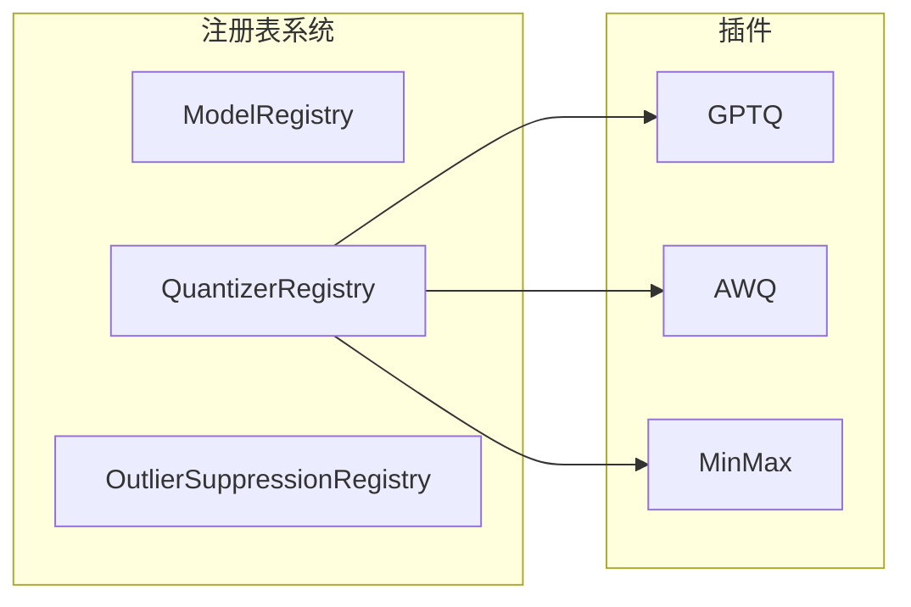
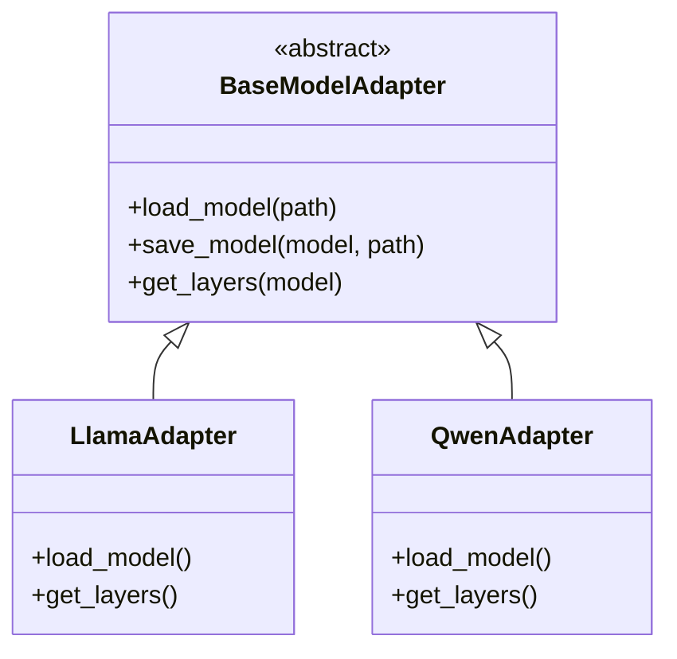
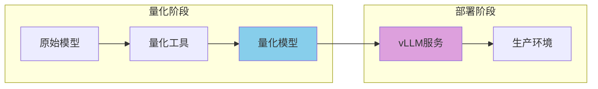
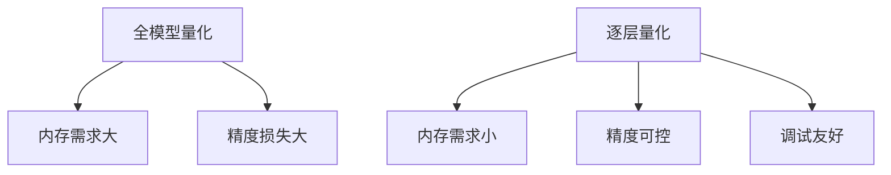
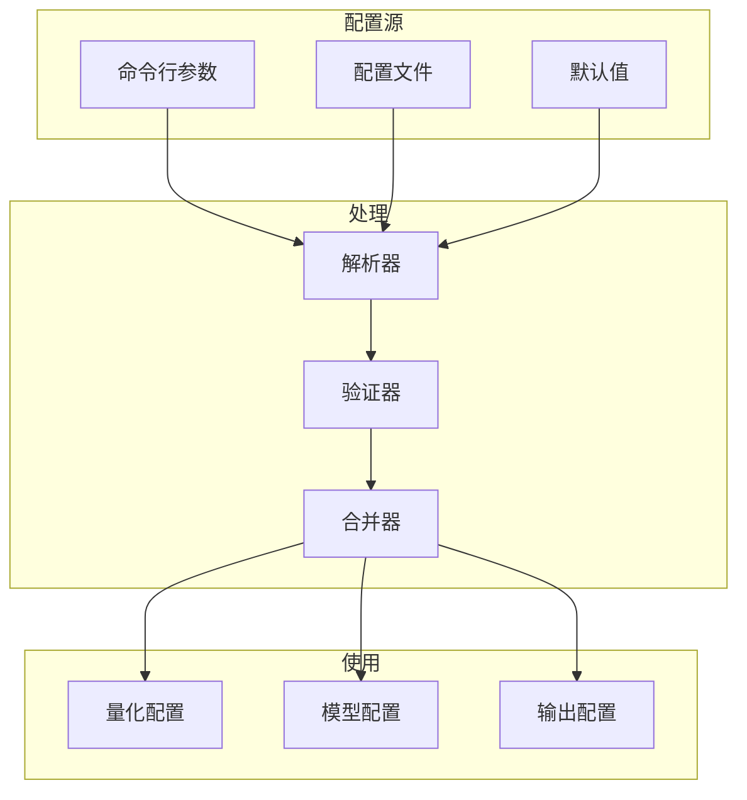
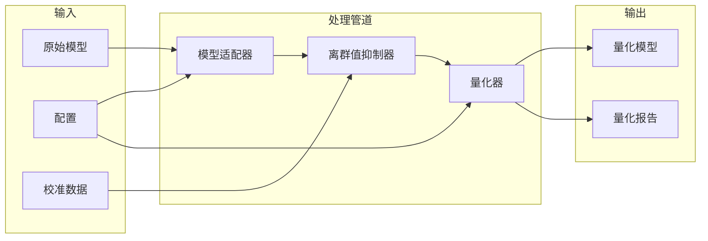

# 设计理念与架构说明

## 🎯 项目概述

大模型量化工具是一个基于**插件化架构**设计的现代化量化框架，旨在提供灵活、可扩展、易用的模型量化解决方案。本文档详细阐述项目的设计理念、架构决策和技术实现。

## 🏗️ 核心设计理念

### 1. 模块化设计原则

我们采用**插件化架构**，将系统分为核心框架和插件层：

```
┌─────────────────────────────────────────────────────────────┐
│                    核心框架 (Core Framework)                │
│  ┌─────────────┐  ┌─────────────┐  ┌─────────────┐        │
│  │ 量化管理器   │  │ 注册表系统   │  │ 配置管理    │        │
│  └─────────────┘  └─────────────┘  └─────────────┘        │
└─────────────────────────────────────────────────────────────┘
                              │
                              ▼
┌─────────────────────────────────────────────────────────────┐
│                    插件层 (Plugin Layer)                    │
│  ┌─────────────┐  ┌─────────────┐  ┌─────────────┐        │
│  │ 量化算法插件 │  │ 模型适配插件 │  │ 抑制算法插件 │        │
│  └─────────────┘  └─────────────┘  └─────────────┘        │
└─────────────────────────────────────────────────────────────┘
```

**设计优势：**

- ✅ **可扩展性**：新算法可以独立开发，不影响现有代码
- ✅ **可维护性**：每个模块职责单一，便于调试和优化
- ✅ **可复用性**：核心框架可以被不同的量化算法复用
- ✅ **可测试性**：每个插件可以独立测试

### 2. 注册表模式 (Registry Pattern)



**为什么选择注册表模式？**

**传统硬编码方式的问题：**
```python
# ❌ 不灵活，难以扩展
if method == "gptq":
    quantizer = GPTQQuantizer()
elif method == "awq":
    quantizer = AWQQuantizer()
# 每添加新算法都要修改代码
```

**注册表方式的优势：**
```python
# ✅ 动态注册，灵活扩展
quantizer = self.quantizer_registry.get_quantizer(method)
# 新算法只需要注册，不需要修改现有代码
```

**设计优势：**
- 🔄 **动态发现**：系统启动时自动注册所有可用插件
- 🔗 **松耦合**：插件之间不直接依赖，通过注册表通信
- ⚙️ **配置驱动**：通过配置文件选择使用哪个插件
- 🔌 **热插拔**：可以在运行时动态加载/卸载插件

## 🔧 核心组件设计

### 1. 量化管理器 (QuantizationManager)

```python
class QuantizationManager:
    def __init__(self):
        self._init_components()  # 初始化注册表
    
    def quantize(self, model_path, method, **kwargs):
        # 1. 获取适配器
        adapter = self.model_registry.get_adapter(model_path)
        
        # 2. 获取量化器
        quantizer = self.quantizer_registry.get_quantizer(method)
        
        # 3. 执行量化
        return quantizer.quantize(model, **kwargs)
```

**设计思路：**
- 🎭 **协调者模式**：管理器不直接实现量化，而是协调各个组件
- 🎯 **策略模式**：不同的量化算法作为不同的策略
- 🏭 **工厂模式**：通过注册表创建具体的组件实例

### 2. 适配器模式 (Adapter Pattern)



**为什么使用适配器？**

1. 🔗 **统一接口**：不同模型有不同的加载方式，适配器提供统一接口
2. 🎯 **模型无关**：量化算法不需要关心具体是哪个模型
3. 🔧 **易于扩展**：新模型只需要实现适配器接口

### 3. 量化器设计

```python
class BaseQuantizer:
    def quantize(self, model, bits, group_size, **kwargs):
        """量化接口"""
        pass
    
    def _add_vllm_compatibility(self, model, bits, group_size):
        """vLLM兼容性"""
        pass
```

**设计特点：**

- 📋 **模板方法模式**：基类定义算法框架，子类实现具体步骤
- 🪝 **钩子方法**：`_add_vllm_compatibility` 是钩子，子类可以重写
- 🔓 **开闭原则**：对扩展开放，对修改封闭

## 🎯 关键设计决策

### 1. vLLM兼容性设计



**为什么强调vLLM兼容性？**

- 🎯 **端到端流程**：量化不是目的，部署才是目标
- 🚀 **生产就绪**：量化的模型必须能在生产环境中使用
- 📊 **标准化**：vLLM是业界标准，兼容性很重要

**实现方式：**
```python
def _add_vllm_compatibility(self, model, bits, group_size):
    """为模型添加vLLM兼容性"""
    # 添加必要的属性
    for name, module in model.named_modules():
        if hasattr(module, 'weight') and module.weight is not None:
            module.qweight = module.weight.data
            module.scales = getattr(module, 'scale', torch.tensor(1.0))
            module.zeros = getattr(module, 'zero_point', torch.tensor(0.0))
            module.bits = bits
            module.quantization_method = "your_method"
```

### 2. 逐层量化支持



**设计优势：**
- 💾 **资源优化**：可以针对重要层保持高精度
- 🔄 **渐进式优化**：可以逐步调整量化策略
- 🔬 **实验友好**：便于研究和调试

**实现示例：**
```python
def _quantize_layer_wise(self, model, bits, group_size, target_layers):
    """逐层量化"""
    layers = self._get_target_layers(model, target_layers)
    
    for name, layer in tqdm(layers, desc="量化层"):
        self._quantize_single_layer(layer, bits, group_size)
    
    return model
```

## 🔄 数据流设计

### 1. 配置驱动的数据流



**设计理念：**
- ⚙️ **配置即代码**：所有行为都可以通过配置控制
- 📊 **分层配置**：命令行 > 配置文件 > 默认值
- 🛡️ **类型安全**：配置验证确保参数正确性

### 2. 插件化的数据流



## 🎨 用户体验设计

### 1. 渐进式复杂度

```bash
# 🟢 最简单的使用
python quantize.py --model-path model --method gptq

# 🟡 中等复杂度
python quantize.py --model-path model --method gptq --bits 4 --group-size 128

# 🔴 高级用法
python quantize.py --model-path model --method gptq --config config.yaml --layer-wise --layers 0,1,2
```

**设计原则：**
- 📊 **80/20法则**：80%的用户只需要20%的功能
- 📈 **渐进式披露**：复杂功能按需展示
- 🎯 **合理的默认值**：开箱即用

### 2. 错误处理设计

```python
try:
    quantizer = self.quantizer_registry.get_quantizer(method)
except KeyError:
    # 提供友好的错误信息和建议
    available_methods = self.quantizer_registry.list_quantizers()
    raise ValueError(f"不支持的量化方法: {method}. 可用方法: {available_methods}")
```

**设计考虑：**
- 😊 **用户友好**：错误信息要能指导用户解决问题
- 🔍 **调试友好**：提供足够的调试信息
- 🛡️ **恢复友好**：错误不应该导致系统崩溃

## 🔮 未来扩展性

### 1. 新量化算法扩展

```python
# 只需要实现这个接口
class NewQuantizer(BaseQuantizer):
    def quantize(self, model, bits, group_size, **kwargs):
        # 实现新的量化算法
        pass
    
    def _add_vllm_compatibility(self, model, bits, group_size):
        # 确保vLLM兼容性
        pass

# 注册到系统
QuantizerRegistry.register("new_method", NewQuantizer)
```

### 2. 新模型支持扩展

```python
class NewModelAdapter(BaseModelAdapter):
    def load_model(self, model_path):
        # 实现新模型的加载逻辑
        pass
    
    def get_layers(self, model):
        # 实现新模型的层获取逻辑
        pass

# 注册到系统
ModelRegistry.register("new_model", NewModelAdapter, patterns=["new_model"])
```

### 3. 新离群值抑制算法

```python
class NewOutlierSuppressor(BaseOutlierSuppressor):
    def apply(self, model, calibration_data):
        # 实现新的抑制算法
        pass
    
    def _ensure_vllm_compatibility(self, model):
        # 确保vLLM兼容性
        pass

# 注册到系统
OutlierSuppressionRegistry.register("new_suppressor", NewOutlierSuppressor)
```

## 📊 设计模式总结

| 设计模式 | 应用场景 | 优势 | 实现示例 |
|----------|----------|------|----------|
| **注册表模式** | 插件管理 | 动态发现、松耦合 | `QuantizerRegistry.register()` |
| **适配器模式** | 模型适配 | 统一接口、易于扩展 | `BaseModelAdapter` |
| **策略模式** | 量化算法 | 算法切换、易于测试 | `BaseQuantizer` |
| **模板方法** | 量化流程 | 代码复用、框架稳定 | `quantize()` 方法 |
| **工厂模式** | 组件创建 | 封装创建逻辑 | `Registry.get_*()` |
| **配置模式** | 参数管理 | 灵活性、可维护性 | YAML配置文件 |

## 🎯 核心价值

这个设计的核心价值在于：

### 1. 🔧 技术价值
- **可扩展性**：新功能可以无缝集成
- **可维护性**：模块化设计便于维护
- **可测试性**：每个组件可以独立测试
- **可复用性**：核心框架可以被多个项目复用

### 2. 👥 用户价值
- **简单易用**：开箱即用，渐进式学习
- **功能强大**：支持多种量化算法和模型
- **生产就绪**：直接支持vLLM部署
- **社区友好**：易于贡献和扩展

### 3. 🚀 商业价值
- **技术领先**：采用现代化架构设计
- **成本效益**：降低模型部署成本
- **生态兼容**：与主流工具链兼容
- **未来导向**：为AI模型优化提供基础设施

## 🔍 设计决策对比

### 传统方式 vs 我们的方式

| 方面 | 传统方式 | 我们的方式 |
|------|----------|------------|
| **架构** | 单体应用 | 插件化架构 |
| **扩展性** | 需要修改核心代码 | 独立插件开发 |
| **维护性** | 耦合度高 | 模块化设计 |
| **测试性** | 难以单元测试 | 组件独立测试 |
| **部署** | 需要额外转换 | 直接vLLM部署 |
| **用户体验** | 复杂配置 | 渐进式复杂度 |

## 📈 性能考虑

### 1. 内存优化
- **逐层量化**：减少内存峰值
- **流式处理**：避免全模型加载
- **智能缓存**：复用计算结果

### 2. 计算优化
- **并行处理**：支持多GPU量化
- **算法优化**：高效的量化算法实现
- **缓存策略**：减少重复计算

### 3. 存储优化
- **压缩存储**：量化模型体积小
- **增量保存**：支持断点续传
- **版本管理**：支持模型版本控制

## 🛡️ 质量保证

### 1. 代码质量
- **类型注解**：完整的类型提示
- **文档字符串**：详细的API文档
- **代码规范**：遵循PEP 8标准

### 2. 测试覆盖
- **单元测试**：每个组件独立测试
- **集成测试**：端到端流程测试
- **性能测试**：量化效果验证

### 3. 错误处理
- **异常处理**：完善的错误处理机制
- **日志记录**：详细的运行日志
- **调试支持**：友好的调试信息

## 🎉 总结

这个量化工具的设计体现了现代软件工程的最佳实践：

1. **架构设计**：插件化、模块化、可扩展
2. **用户体验**：简单易用、功能强大
3. **技术实现**：高质量、高性能、高可靠
4. **未来导向**：为AI模型优化提供基础设施

通过这种设计，我们不仅创建了一个量化工具，更建立了一个**可扩展的量化生态系统**，能够适应不断发展的AI模型和量化技术，为用户提供最佳的量化体验。 