# Mermaid 图表集合

本文档包含使用 Mermaid 绘制的各种图表，用于展示大模型量化工具的系统架构、流程和组件关系。

## 1. 系统架构图

### 1.1 整体架构

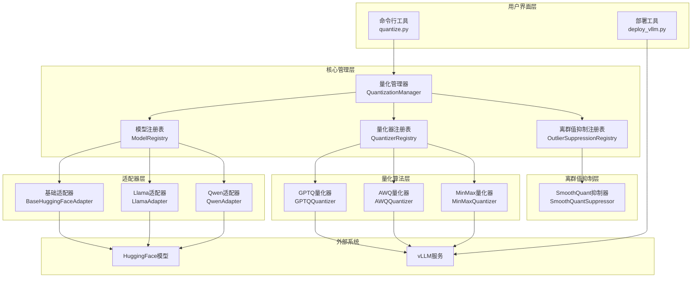

### 1.2 组件关系图

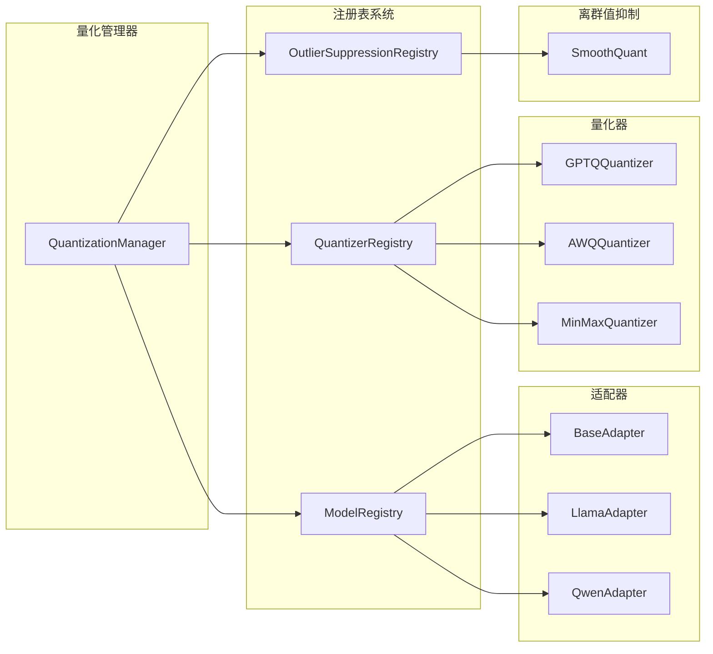

## 2. 流程图

### 2.1 量化流程

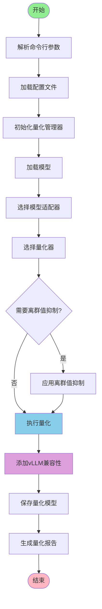

### 2.2 逐层量化流程

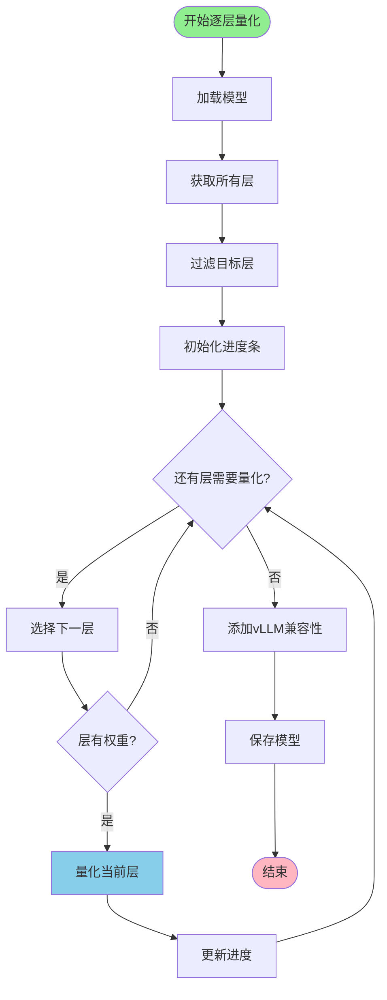

### 2.3 注册表工作流程

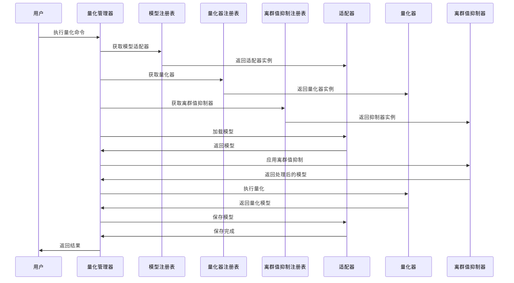

## 3. 类图

### 3.1 核心类关系

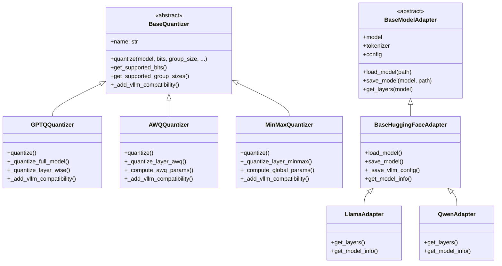

### 3.2 注册表类关系

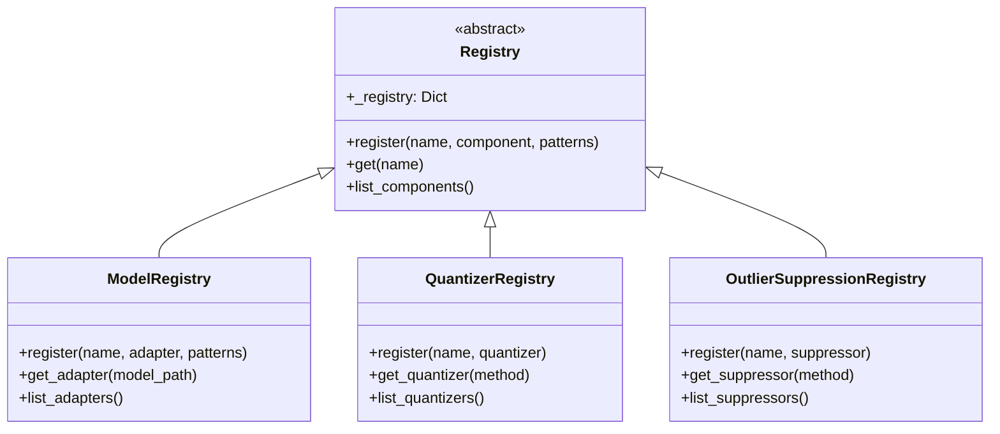

## 4. 部署架构图

### 4.1 vLLM部署流程

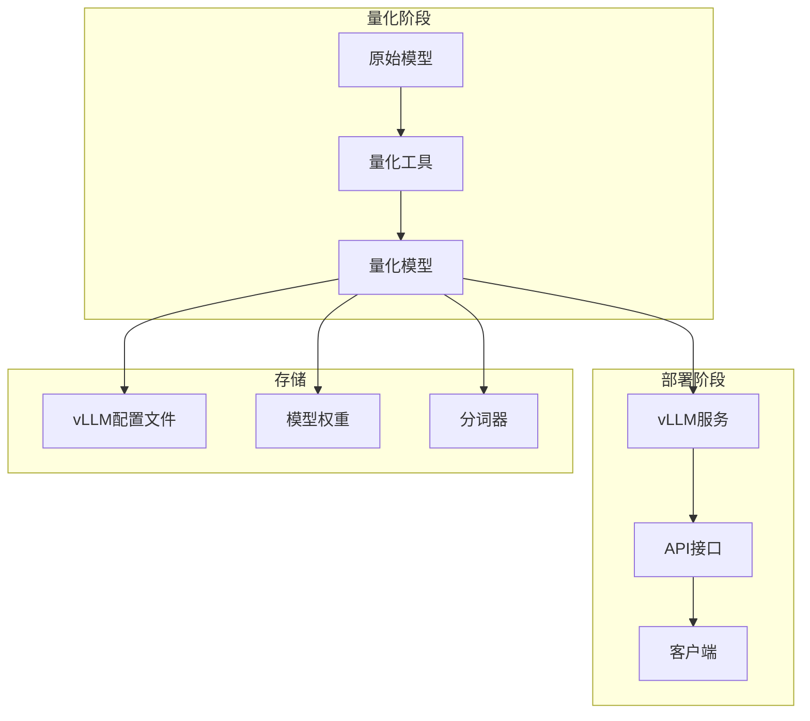

### 4.2 文件结构图

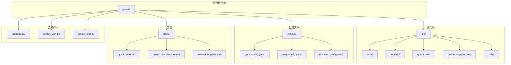

## 5. 数据流图

### 5.1 量化数据流

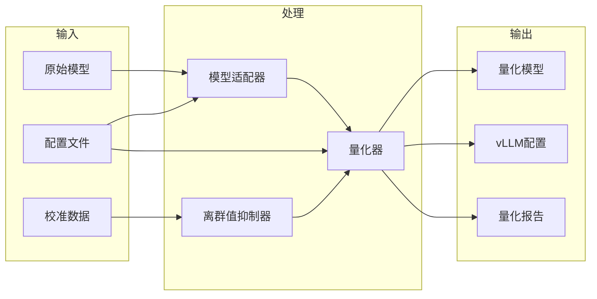

### 5.2 配置数据流

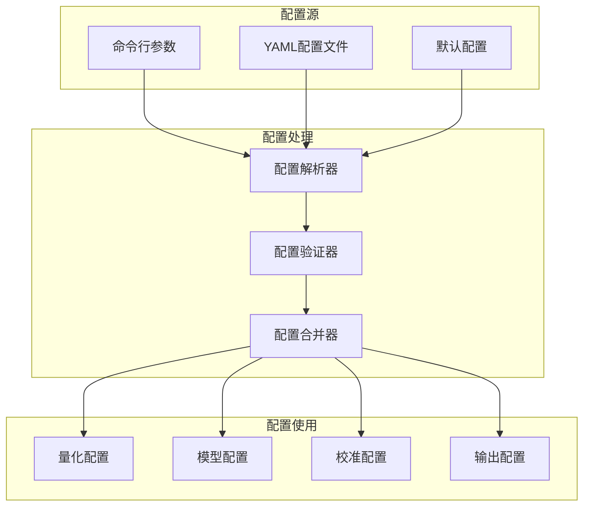

## 6. 状态图

### 6.1 量化状态转换

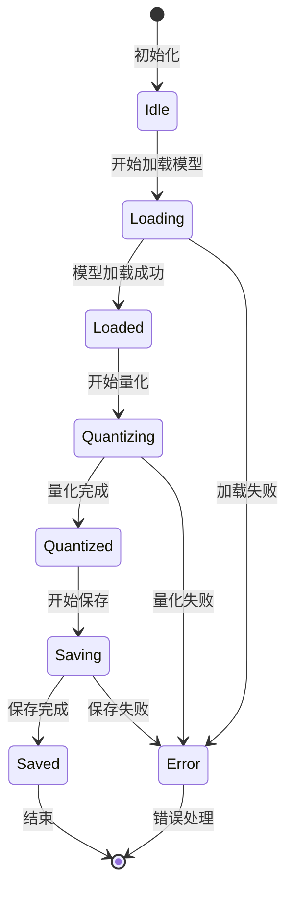

### 6.2 注册表状态

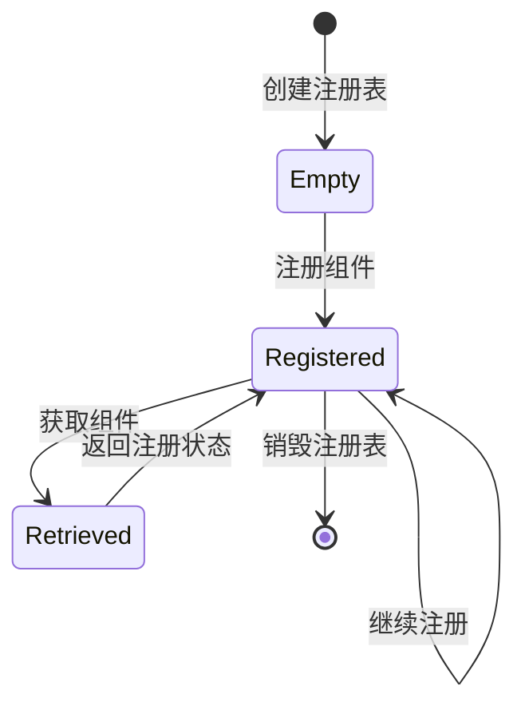

## 7. 甘特图

### 7.1 量化任务时间线

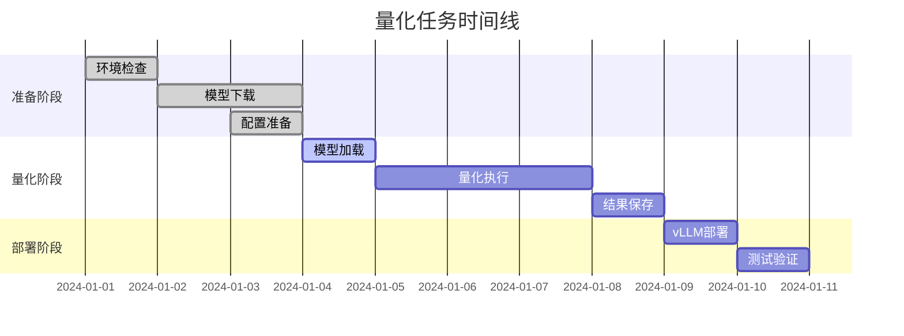

## 8. 饼图

### 8.1 量化方法分布

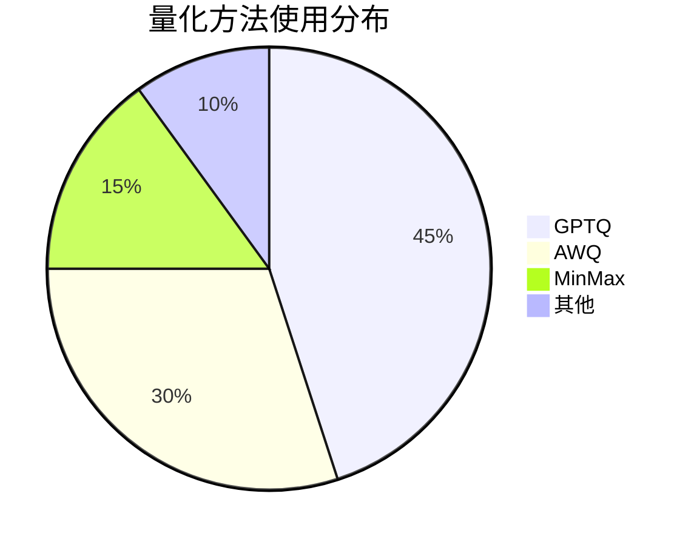

### 8.2 模型类型分布

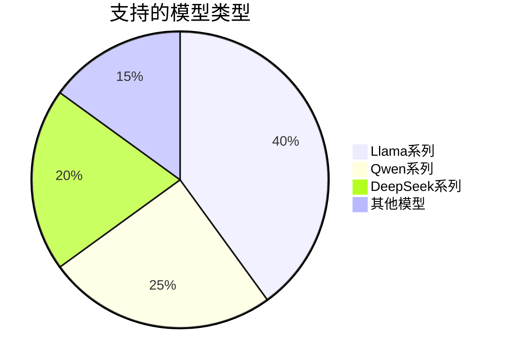

## 使用说明

这些Mermaid图表可以：

1. **在Markdown中使用**：直接复制图表代码到Markdown文件中
2. **在GitHub中显示**：GitHub原生支持Mermaid图表
3. **在文档工具中渲染**：如GitBook、Docusaurus等
4. **在线编辑**：使用 [Mermaid Live Editor](https://mermaid.live/)

## 图表维护

- 当系统架构发生变化时，请及时更新相应的图表
- 保持图表简洁明了，避免过于复杂
- 使用统一的颜色和样式规范
- 为图表添加适当的标题和说明
``` 