# Mermaid 图表使用示例

本文档展示如何在项目文档中嵌入和使用 Mermaid 图表。

## 1. 在 Markdown 中嵌入图表

### 基本语法

```markdown
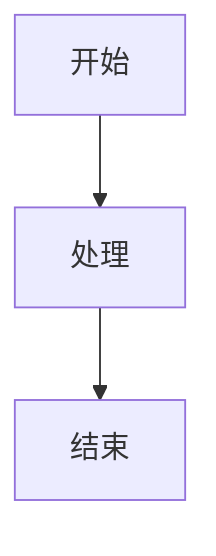
```

### 实际示例

#### 量化流程简化图


#### 组件关系图

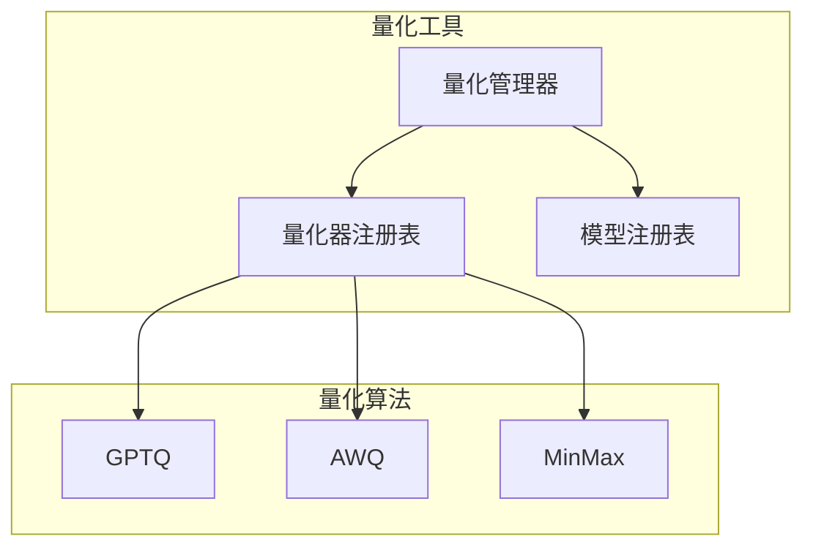

## 2. 在 GitHub 中的显示

GitHub 原生支持 Mermaid 图表，你只需要：

1. 在 Markdown 文件中使用 ````mermaid` 代码块
2. 在代码块内编写 Mermaid 语法
3. GitHub 会自动渲染图表

### 示例：在 README 中嵌入

```markdown
# 项目架构

我们的量化工具采用模块化设计：

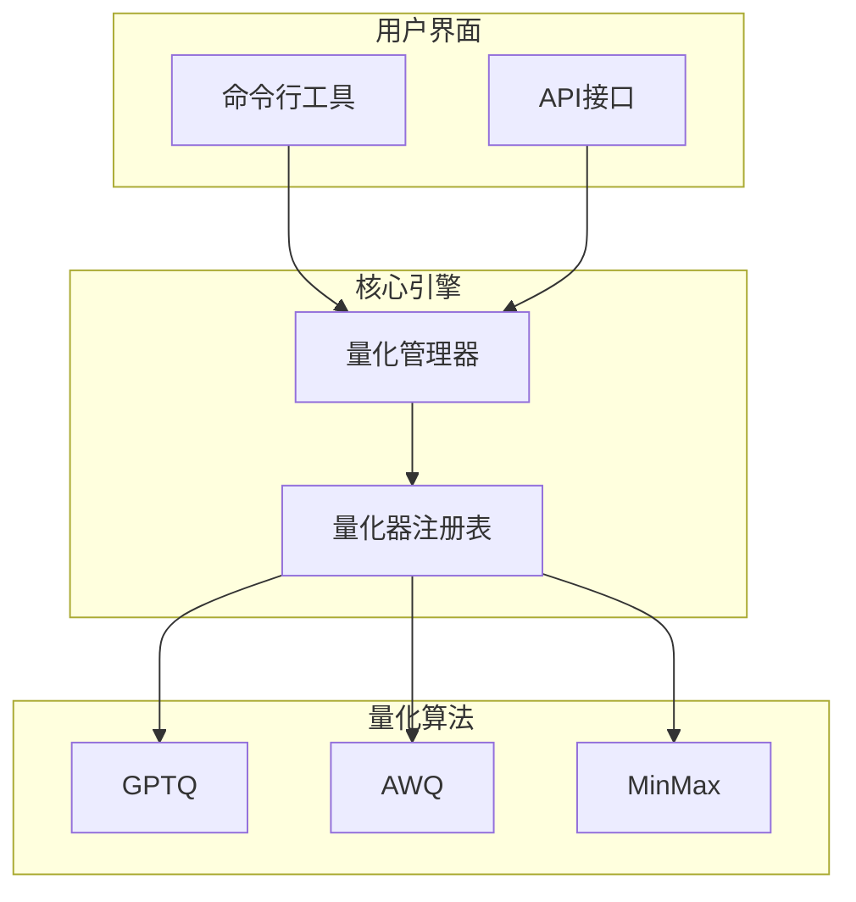

## 3. 在文档工具中的使用

### GitBook

GitBook 支持 Mermaid 图表，可以直接使用相同的语法。

### Docusaurus

在 Docusaurus 中，需要安装 `@docusaurus/theme-mermaid` 插件：

```bash
npm install @docusaurus/theme-mermaid
```

然后在 `docusaurus.config.js` 中配置：

```javascript
module.exports = {
  themes: ['@docusaurus/theme-mermaid'],
  markdown: {
    mermaid: true,
  },
}
```

## 4. 在线编辑和预览

### Mermaid Live Editor

使用 [Mermaid Live Editor](https://mermaid.live/) 来：

1. **在线编辑**：实时编辑和预览图表
2. **导出图片**：将图表导出为 PNG、SVG 等格式
3. **代码生成**：生成 Mermaid 代码

### 使用步骤

1. 访问 https://mermaid.live/
2. 在左侧编辑器中编写 Mermaid 代码
3. 右侧实时预览图表效果
4. 调整样式和布局
5. 复制代码到你的文档中

## 5. 常用图表类型

### 流程图 (Flowchart)

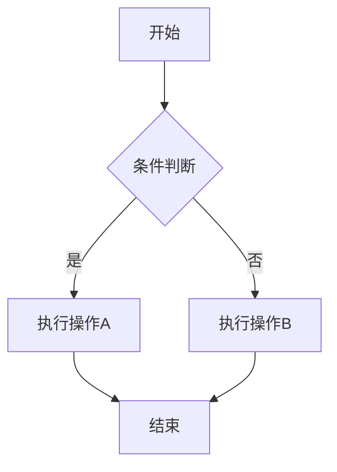

### 时序图 (Sequence Diagram)

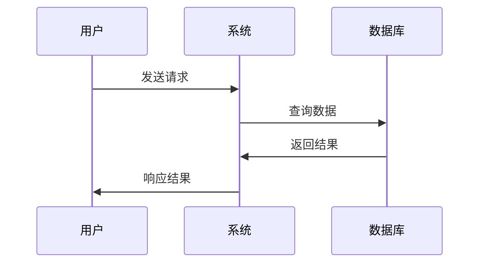

### 类图 (Class Diagram)

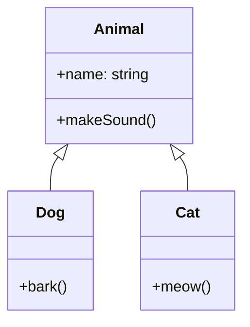

### 甘特图 (Gantt Chart)

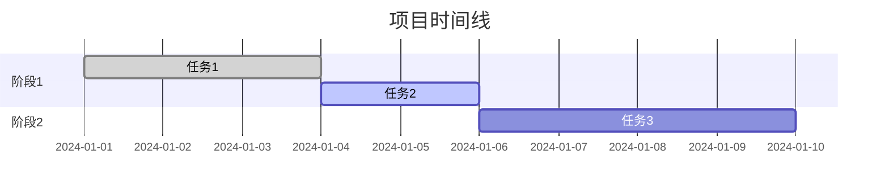

### 饼图 (Pie Chart)

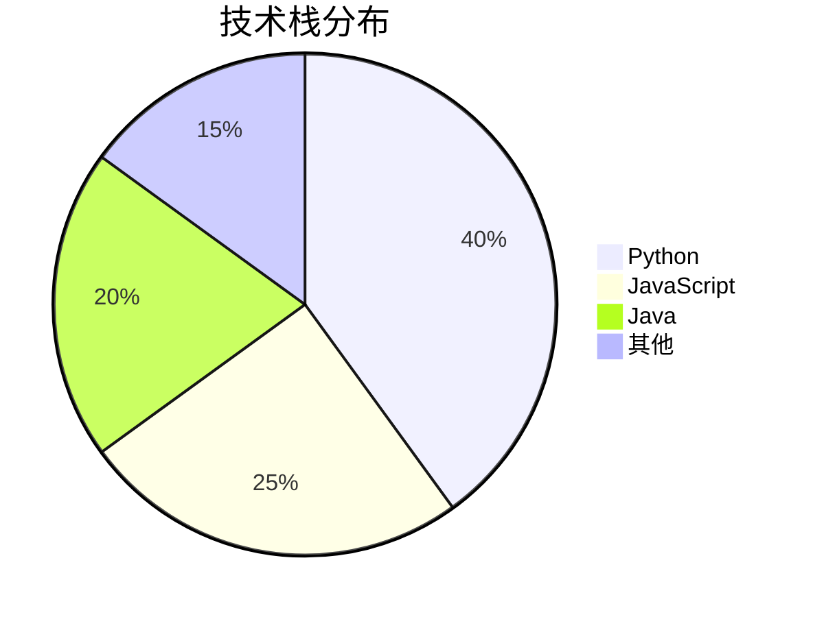

## 6. 样式定制

### 节点样式

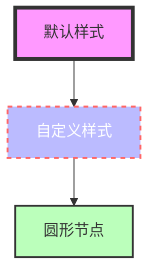

### 主题设置

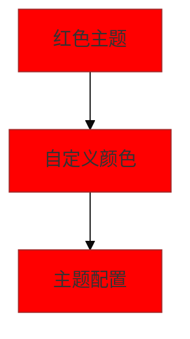

## 7. 最佳实践

### 图表设计原则

1. **简洁明了**：避免过于复杂的图表
2. **层次清晰**：使用分组和颜色区分不同层次
3. **信息完整**：确保图表包含必要的信息
4. **易于维护**：保持图表代码的可读性

### 代码组织

```markdown
## 系统架构

### 整体架构图

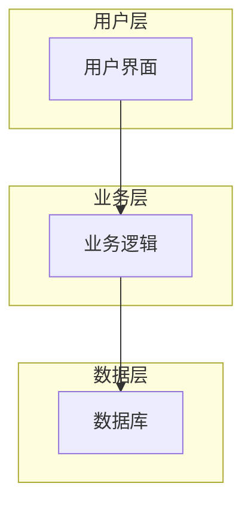

### 详细组件图

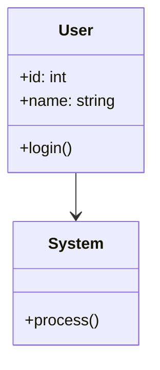
```

### 版本控制

1. **保持图表同步**：当系统架构变化时，及时更新图表
2. **版本标记**：在图表标题中标注版本信息
3. **变更记录**：记录图表的变更历史

## 8. 故障排除

### 常见问题

1. **图表不显示**：检查 Mermaid 语法是否正确
2. **样式问题**：确认样式语法和颜色值
3. **布局混乱**：调整节点位置和连接方式

### 调试技巧

1. 使用 Mermaid Live Editor 进行语法检查
2. 逐步构建复杂图表
3. 参考官方文档和示例

## 总结

Mermaid 图表是展示系统架构和流程的强大工具。通过合理使用各种图表类型，可以让文档更加直观和易于理解。记住保持图表简洁、信息完整，并定期更新以反映系统的最新状态。 